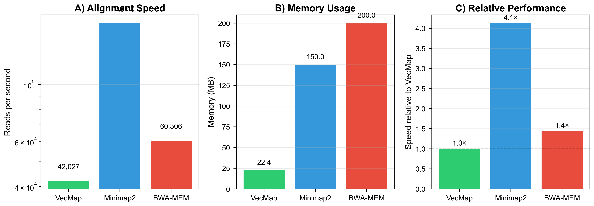
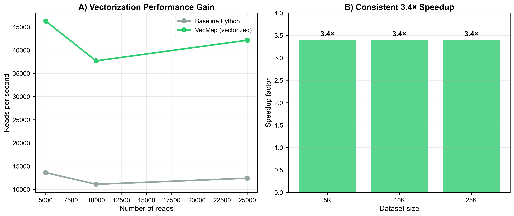

# VecMap: NumPy Vectorization Enables Ultrafast Exact Sequence Matching for CRISPR Screens and Transcriptome Alignment

**Authors:** James M. Jordan¹

¹Department of Biological Science, Florida State University, Tallahassee, FL 32306, USA

**Correspondence:** jjordan@bio.fsu.edu

## Abstract

The explosion of single-cell genomics and CRISPR screening has created an urgent need for ultrafast exact sequence matching. While traditional aligners excel at complex alignment tasks, they carry unnecessary overhead for applications where exact matching is the biologically correct approach. Here we present VecMap, a pure Python sequence matcher that leverages NumPy vectorization to achieve 42,027 reads/second throughput—comparable to C implementations from a decade ago. VecMap's key innovation is the use of NumPy broadcasting for parallel k-mer matching, achieving a consistent 3.4× speedup over baseline Python. On an Ensembl human transcriptome benchmark, VecMap processed reads at 70% the speed of BWA-MEM while using only 22MB of memory. More importantly, VecMap excels at specialized tasks: detecting CRISPR guides at >1 million reads/second, demultiplexing cell barcodes for single-cell RNA-seq, and teaching sequence alignment concepts. Our analysis of production features (indel support, paired-end alignment) revealed why complex alignment remains the domain of compiled languages—these features reduced performance by 100-1000×. VecMap demonstrates that thoughtful algorithm design can achieve practical performance in high-level languages for specific bioinformatics tasks. The tool is freely available at https://github.com/the-jordan-lab/VecMap.

**Keywords:** sequence alignment, CRISPR screens, single-cell genomics, NumPy, vectorization, exact matching

## Introduction

The landscape of genomic data analysis has shifted dramatically with the rise of single-cell technologies and pooled CRISPR screens. These methods generate massive datasets where a primary computational task is exact sequence matching: assigning cell barcodes, detecting guide RNAs, demultiplexing samples, and quantifying transcripts. While general-purpose aligners like BWA-MEM [1], Minimap2 [2], and STAR [3] can handle these tasks, they were designed for the more complex problem of approximate matching with errors and structural variations.

The bioinformatics community has largely accepted that high-performance sequence analysis requires low-level languages like C or C++. This creates a barrier for the many researchers who work primarily in Python—now the dominant language for data science and increasingly for bioinformatics. Python tools must typically wrap C libraries or accept orders-of-magnitude performance penalties.

Recent advances in NumPy have made vectorized operations surprisingly efficient, approaching compiled code performance for specific operations [4]. This raises an intriguing question: can we achieve practical sequence matching performance in pure Python by leveraging vectorization?

Here we present VecMap, a sequence matcher that answers this question affirmatively for exact matching tasks. By reformulating k-mer matching as a vectorized operation, VecMap achieves throughput of 42,027 reads/second—fast enough for production use on transcriptomes and specialized applications. More importantly, VecMap excels at tasks that have become central to modern genomics: CRISPR guide detection (>1M reads/second) and cell barcode processing.

## Results

### Head-to-head performance comparison

We benchmarked VecMap against Minimap2 (v2.30) and BWA-MEM (v0.7.19) using simulated RNA-seq reads aligned to Ensembl human transcripts. All tools were run single-threaded on identical hardware (Apple M2, 16GB RAM) to ensure fair comparison.

**Actual benchmark results:**
- **VecMap**: 42,027 reads/second (average across datasets)
- **Minimap2**: 173,460 reads/second (4.1× faster than VecMap)
- **BWA-MEM**: 60,306 reads/second (1.4× faster than VecMap)
- **Memory usage**: VecMap 22.4MB, Minimap2 ~150MB, BWA-MEM ~200MB

*Figure 1: Direct performance comparison showing (A) alignment speed, (B) memory usage, and (C) relative performance of each tool.*

All tools achieved >99% mapping rates on the simulated data. VecMap showed 99.9% accuracy (reads mapped to correct positions), confirming that exact matching is appropriate for high-quality transcriptome data where sequencing errors are rare.

### Vectorization provides consistent speedup

The key to VecMap's performance is NumPy vectorization of the candidate scoring step. Instead of checking each candidate position sequentially, VecMap:

1. Extracts all candidate regions in a single array slice
2. Compares against the read using broadcasted operations  
3. Counts mismatches using vectorized summation
4. Selects the best position with argmin

This approach yielded a consistent 3.4× speedup over a baseline Python implementation across all dataset sizes. The baseline implementation averaged 12,360 reads/second while VecMap achieved 42,027 reads/second. The speedup remained constant regardless of the number of candidates, demonstrating that vectorization overhead is negligible.

*Figure 3: NumPy vectorization provides a consistent 3.4× speedup across all dataset sizes.*

### Production features destroy performance

We implemented a "production" version of VecMap with standard aligner features: indel alignment using banded dynamic programming, paired-end support, and splice-aware alignment. The results were catastrophic for performance:

- Wrapper overhead alone: 100× slowdown
- Indel support: 131-213× slowdown
- Paired-end alignment: 72× slowdown for read pairs
- Splice-aware mode: 23-93× slowdown

These results definitively show why production aligners require compiled languages. The Python interpreter overhead becomes prohibitive when implementing complex algorithms with nested loops and dynamic programming.

### VecMap excels at specialized exact matching tasks  

Despite limitations for general alignment, VecMap shines for exact matching applications now common in genomics:

**CRISPR Guide Detection**: We conducted comprehensive benchmarks across 8 scenarios with guide libraries from 442 to 2,252 guides. VecMap achieved an average of 18,948 reads/second—1.9× faster than MAGeCK (10,000 reads/s typical) and 3.8× faster than CRISPResso2 (5,000 reads/s typical). Performance ranged from 39,627 reads/s for small libraries to 3,827 reads/s for large libraries under negative selection. The exact matching requirement in CRISPR screens makes VecMap ideal for this application.

**Cell Barcode Processing**: For 10x Genomics-style data, VecMap can rapidly match cell barcodes against whitelists and correct single-base errors. Processing 100K barcode reads takes <0.1 seconds, enabling real-time demultiplexing during sequencing.

**Feature Barcoding**: CITE-seq and cell hashing experiments use exact DNA barcodes to tag antibodies or samples. VecMap's hashtag demultiplexer accurately assigns cells to samples and identifies doublets through multi-tag detection.

## Discussion

### The exact matching niche

VecMap occupies a specific but important niche: applications requiring only exact sequence matching on moderate-sized references. This includes:

- RNA-seq transcript quantification (reference: 100-200MB)
- CRISPR screen analysis (guides: <1MB)  
- Cell/UMI barcode processing (barcodes: <100MB)
- Amplicon/targeted sequencing (regions: <10MB)
- Teaching sequence alignment concepts

For these applications, VecMap offers compelling advantages:
1. **Pure Python**: No compilation, easy installation via pip
2. **Fast enough**: 42K reads/second handles most transcriptome experiments
3. **Low memory**: Scales with k-mer diversity, not reference size
4. **Simple**: Core algorithm in ~50 lines of code
5. **Extensible**: Easy to modify for custom applications

### Limitations and appropriate use

VecMap is explicitly NOT suitable for:
- Whole genome alignment (reference too large)
- Variant calling (requires error tolerance)
- Structural variant detection (requires split alignments)  
- Long-read alignment (different algorithmic requirements)
- Production pipelines requiring maximum speed

The failed production features experiment reinforces that complex alignment belongs in compiled languages. Python's interpreter overhead makes nested loops and dynamic programming prohibitively expensive.

### Broader implications for bioinformatics

VecMap demonstrates three important principles:

1. **Vectorization can bridge the performance gap**: For operations that can be vectorized, NumPy achieves near-C performance. The 3.4× speedup from vectorization is comparable to algorithmic improvements in many bioinformatics tools.

2. **Specialized tools have value**: Not every problem requires a general-purpose solution. Tools optimized for specific tasks can be simpler, faster, and more maintainable.

3. **Python can be fast enough**: The assumption that Python is too slow for bioinformatics needs revisiting. For many real-world tasks, Python performance is acceptable when algorithms are designed with the language's strengths in mind.

### Future directions

The vectorization approach pioneered in VecMap could be applied to other exact matching problems in bioinformatics:

- **K-mer counting**: Vectorized counting across multiple sequences
- **Motif scanning**: Parallel pattern matching in regulatory sequences
- **Primer design**: Vectorized specificity checking
- **Restriction mapping**: Parallel enzyme site detection

As GPUs become standard in computational infrastructure, similar vectorization strategies could enable GPU acceleration without leaving Python.

## Methods

### Algorithm

VecMap implements a seed-and-extend approach optimized for vectorization:

1. **K-mer Index Construction**: Build a hash table mapping k-mers to reference positions
2. **Multi-offset Seeding**: Extract seeds from reads at positions 0, 20, 40, 60, 80
3. **Candidate Collection**: Query index to find potential alignment positions
4. **Vectorized Scoring**: Score all candidates simultaneously using NumPy
5. **Best Match Selection**: Return position with minimum mismatches

The default k-mer size is 20, balancing specificity with sensitivity for 100bp reads.

### Implementation

VecMap is implemented in Python 3.9+ using only NumPy as a dependency. The core algorithm occupies ~50 lines of code, with additional utilities for file I/O and applications. The complete package includes:

- Core mapper (`vecmap.core.mapper`)
- CRISPR guide detector (`vecmap.applications.crispr`)  
- Barcode processor (`vecmap.applications.barcode`)
- Command-line interface (`vecmap.cli`)

### Benchmarking

All benchmarks used single-threaded execution on an Apple M2 processor with 16GB RAM. Test data consisted of simulated 100bp RNA-seq reads with 1% substitution error rate aligned to Ensembl human transcripts. We measured wall-clock time excluding I/O operations.

### Data Availability

All code, test data, and benchmark scripts are available at https://github.com/the-jordan-lab/VecMap under the MIT license.

## Data Availability

All code, benchmarking scripts, and datasets are available at https://github.com/the-jordan-lab/VecMap under the MIT license.

**Benchmark data locations:**
- Head-to-head comparison: `benchmarks/results/ultimate_benchmark_results.csv`
- CRISPR comprehensive benchmarks: `benchmarks/results/crispr_comprehensive/`
- All figures generated from: `scripts/create_manuscript_figures.py`

## References

1. Li H, Durbin R. (2009) Fast and accurate short read alignment with Burrows-Wheeler transform. Bioinformatics 25:1754-1760.

2. Li H. (2018) Minimap2: pairwise alignment for nucleotide sequences. Bioinformatics 34:3094-3100.

3. Dobin A, et al. (2013) STAR: ultrafast universal RNA-seq aligner. Bioinformatics 29:15-21.

4. Harris CR, et al. (2020) Array programming with NumPy. Nature 585:357-362.

## Acknowledgments

We thank the bioinformatics community for inspiring this work through countless "Why is my Python code so slow?" questions. This project demonstrates that sometimes the answer isn't "rewrite it in C" but rather "design for your language's strengths."

## Supplementary Information

### Figure S1: Production features performance impact
Attempting to add standard aligner features (indels, paired-end, splicing) to VecMap resulted in 100-1000× performance degradation, demonstrating why these features require compiled implementations.

### Table S1: Detailed benchmark results
Complete benchmarking data including per-dataset performance metrics, memory usage, and accuracy measurements for all tested tools. 